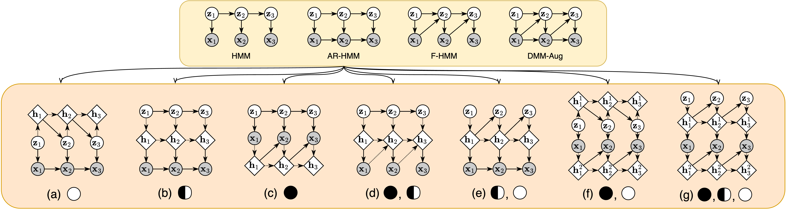

# A Hierarchical Taxonomy for Deep State Space Models (DSSMs)

This repository contains the implementation of the framework presented in our paper **"A Taxonomy for Deep State Space Models"** by Shiqin Tang, Pengxing Feng, Shujian Yu, Yining Dong, and S. Joe Qin. The paper introduces a comprehensive taxonomy of deep state space models (DSSMs), categorizing them based on their conditional independence properties and exploring the integration of normalizing flows to enhance model performance.



# Abstract
There have been multiple attempts on modeling nonlinear dynamical systems, but these efforts appear to lack a clear unifying theme. This paper presents a comprehensive framework of deep state space models, each with distinct conditional independence properties. We discuss how previously proposed models, such as Stochastic Recurrent Neural Network (SRNN), Variational Recurrent Neural Network (VRNN), and Recurrent State Space Model (RSSM), fit into our framework, and highlight their connections and distinctions. Additionally, we explore the integration of normalizing flows as a means to enhance model performance, leveraging their ability to model complex distributions. Among the plethora of models introduced, we focus on the Autoregressive State-Space Model (ArSSM), evaluating its performance on speech and polyphonic music modeling tasks. 

# Key Contributions
- Framework Introduction: A comprehensive framework categorizing DSSMs based on conditional independence properties.
- Inference Networks: Analysis and discussion on different types of inference networks.
- Normalizing Flows Integration: Enhancement of posterior approximations to improve the tightness of the variational bound.
- ArSSM: Introduction and evaluation of the Autoregressive State-Space Model, demonstrating superior performance in speech and music tasks.

# Implemented Models
The repository provides the implementation of the following models:

- **Variational Recurrent Neural Network (VRNN)**
- **Stochastic Recurrent Neural Network (SRNN)**
- **Recurrent State Space Model (RSSM)**
- **Autoregressive State Space Model (ArSSM)**
- **Feedforward State Space Model (FSSM)**

## Installation

Clone the repository and install the required packages:

```bash
git clone https://github.com/marcusstang/DSSMs.git
cd DSSMs
pip install -r requirements.txt
```

## Datasets

### Speech Modeling Task
To download the dataset for the speech modeling task, use the LibriSpeech dataset. Specifically, we use the `dev-clean.tar.gz` dataset, which can be downloaded from the following link:

[Download LibriSpeech Dataset](https://www.openslr.org/12/)

### Polyphonic Music Generation Task
For the polyphonic music generation task, you can directly download the dataset using Python's Pyro library. Use the following code snippet to load the `JSB Chorales` dataset:

```python
import pyro.contrib.examples.polyphonic_data_loader as poly
data = poly.load_data(poly.JSB_CHORALES)
```

## Acknowledgements
Our implementation is inspired by the following works:

- [Pyro DMM Example](https://github.com/pyro-ppl/pyro/blob/dev/examples/dmm.py): This code provides an excellent foundation for implementing deep state space models using Pyro. We adapted some of their model structures and training routines to suit our framework.
- [DVAE Implementation](https://github.com/XiaoyuBIE1994/DVAE): This implementation guided our approach to building variational autoencoders within our framework, particularly in designing inference networks.

We would like to acknowledge these contributions and thank the authors for making their code publicly available.

